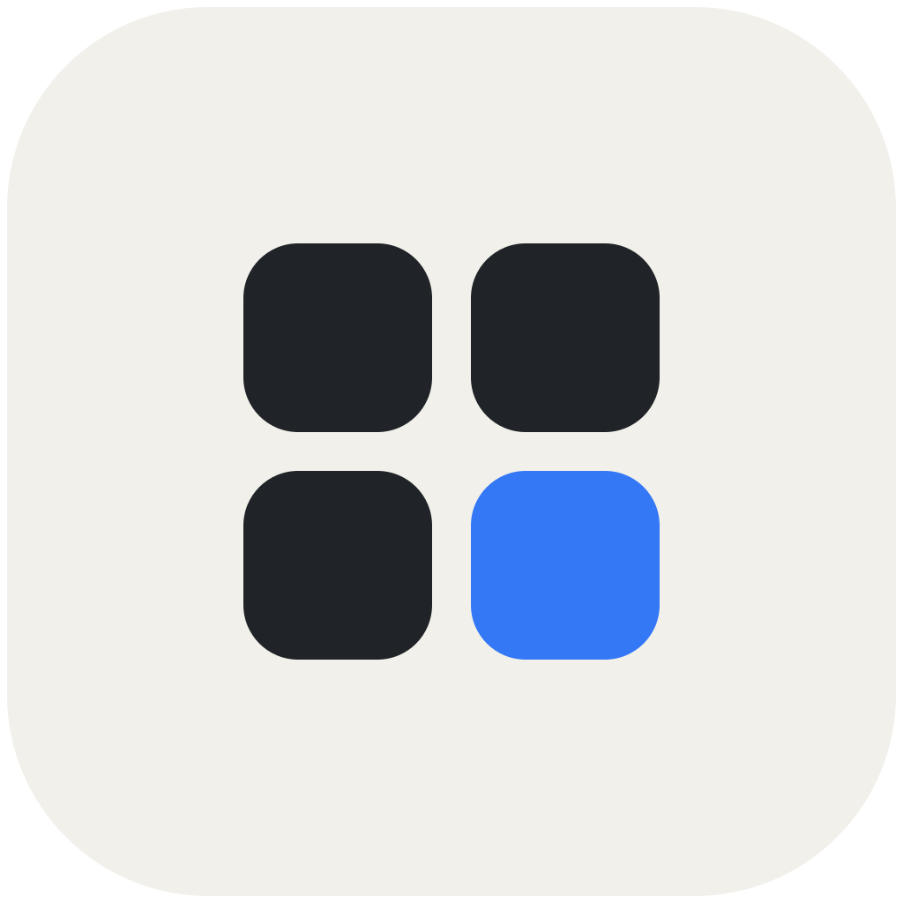

> **纯 AI 编写：LaunchPoint 的代码、界面、图标、文档与构建流程均由 AI 完整生成和实现。**

<p align="center">
  
</p>

<h1 align="center">LaunchPoint</h1>

<p align="center">
  原生 macOS 应用启动器。快速唤起、即时搜索，自由整理你的应用。
</p>

<p align="center">
  <a href="https://github.com/Wning-ady/LaunchPoint/releases/download/v0.1.0/LaunchPoint-v0.1.0-arm64.dmg"><strong>Apple Silicon 下载</strong></a>
  ·
  <a href="https://github.com/Wning-ady/LaunchPoint/releases/download/v0.1.0/LaunchPoint-v0.1.0-x86_64.dmg"><strong>Intel 下载</strong></a>
  ·
  <a href="https://github.com/Wning-ady/LaunchPoint/releases">全部发行版</a>
  ·
  <a href="https://github.com/Wning-ady/LaunchPoint/issues">问题反馈</a>
</p>

<p align="center">
  macOS 14+ · Swift 6 · MIT License · 当前版本 v0.1.0
</p>

## 简介

LaunchPoint 专注于应用启动这一件事：以原生、清晰、可调整的网格呈现 Mac 上的应用，并让搜索、翻页、整理和个性化设置保持快速直接。

应用扫描、图标读取、搜索和壁纸处理均采用后台任务；布局与偏好保存在本机，不需要账号。

## 功能

### 浏览与搜索

- 横向分页与纵向连续滚动两种网格模式。
- 支持应用名称、缩写和拼音即时搜索。
- 支持鼠标、触控板、滚轮、方向键和页码导航。
- 根据屏幕和行列数自动收敛图标与标签尺寸。

### 应用整理

- 拖拽排序、跨页移动、创建文件夹和文件夹改名。
- 隐藏、恢复、别名、简介、卸载及在 Finder 中显示。
- 布局导入、导出和持久化保存。
- 应用与文件夹独立右键菜单。

### 外观与布局

- 自定义行列数、图标大小、横向间距和纵向间距。
- 系统毛玻璃与当前桌面壁纸背景。
- 设置调整实时预览，并通过防抖减少连续写盘。
- 米白、炭黑和系统蓝组成的统一界面配色。

### 系统集成

- 自定义全局快捷键、F4 开关和触发角。
- 主显示器、活跃显示器和鼠标所在显示器策略。
- 登录时启动与菜单栏入口。
- 应用内检查 GitHub Releases 更新，并自动匹配当前处理器架构。

## 安装

| Mac | 安装包 |
| --- | --- |
| Apple Silicon | [下载 arm64 DMG](https://github.com/Wning-ady/LaunchPoint/releases/download/v0.1.0/LaunchPoint-v0.1.0-arm64.dmg) |
| Intel | [下载 x86_64 DMG](https://github.com/Wning-ady/LaunchPoint/releases/download/v0.1.0/LaunchPoint-v0.1.0-x86_64.dmg) |

1. 打开与你的 Mac 匹配的 DMG。
2. 将 `LaunchPoint.app` 拖入 `Applications`。
3. 首次启动时右键应用并选择“打开”。

当前 Beta 使用 ad-hoc 签名，尚未进行 Developer ID 签名与公证。

## 源码构建

需要 macOS 14 或更高版本及 Xcode Command Line Tools。运行：

```bash
./build.sh
```

脚本会一次生成两种架构的 App 与 DMG：

```text
dist/LaunchPoint-arm64.app
dist/LaunchPoint-x86_64.app
dist/LaunchPoint-v0.1.0-arm64.dmg
dist/LaunchPoint-v0.1.0-x86_64.dmg
```

严格类型检查：

```bash
xcrun swiftc -warnings-as-errors -typecheck \
  Sources/LaunchPoint/*.swift \
  -framework AppKit \
  -framework SwiftUI \
  -framework Carbon \
  -framework ServiceManagement
```

<details>
<summary><strong>项目结构</strong></summary>

```text
Sources/LaunchPoint/
├── AppTheme.swift       # 全局配色
├── AppScanner.swift     # 应用来源扫描
├── ContentView.swift    # 主界面与交互
├── KeyboardNav.swift    # 键盘导航
├── LayoutStore.swift    # 布局与持久化
├── SearchEngine.swift   # 搜索与排序
├── Settings.swift       # 设置界面与偏好
├── UpdateChecker.swift  # GitHub 发行版更新检测
└── main.swift           # 应用入口与系统集成

Resources/
├── AppIcon.svg
└── AppIcon.icns
```

</details>

<details>
<summary><strong>本地数据</strong></summary>

布局数据保存在：

```text
~/Library/Application Support/LaunchPoint/layout.json
```

偏好设置使用 bundle identifier：

```text
com.waning.launchpoint
```

</details>

## 开源

LaunchPoint 依据 [MIT License](LICENSE) 开源。欢迎通过 [Issue](https://github.com/Wning-ady/LaunchPoint/issues) 提交问题、建议和兼容性反馈。

## 当前限制

- 安装包尚未公证。
- 纵向滚动模式暂不支持图标拖拽重排。
- 多显示器、触控板惯性和大量应用场景仍在持续测试。
